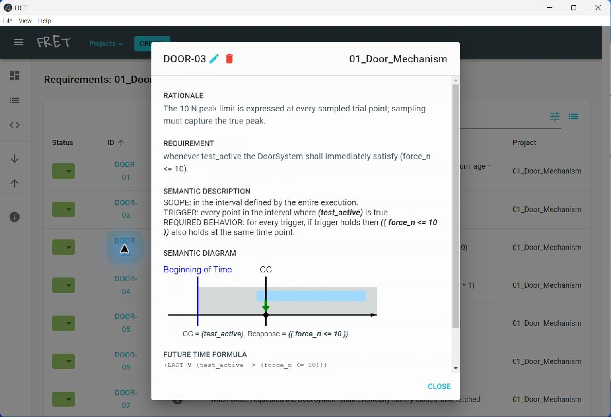

# FRET toy projects: requirements, semantics and evidence

An executable research archive of **10 separate NASA FRET projects containing 61 formalized requirements**. It connects natural-language examples from a requirements-uncertainty study to FRETish specifications, temporal-logic formulas, semantic diagrams, and explicitly scoped behavioral evidence.

Research direction: **Volkan Aran**. Formalization, code, documentation and analysis were developed with **OpenAI Codex under human direction**. This is a companion research archive, organized similarly to [TMATS-GPR-Poly2-Control](https://github.com/volkanaranengineering/TMATS-GPR-Poly2-Control), not a NASA-maintained FRET distribution or an endorsed engineering design.

## Start here

- **[Critical literature survey and research gap](entropy/literature/README.md)** — 19-page report; 18 journal papers (2006–2026 window), supporting and counter-evidence, a separate ARTEMIS comparison, and a proposed evaluation protocol.
- **[Three entropy implementations on the two setup requirements](entropy/README.md)** — separate semantic interpretation, behavioral freedom, and active clarification experiments; [interactive results](entropy/index.html).
- **[Complete browsable FRET output](projects/index.html)** — clone/download and open locally; GitHub displays HTML source, not the rendered report.
- **[All 10 projects, importable JSON](projects/all-projects.json)** — import using FRET's downward-arrow button.
- **[Turkish FRET tutorial, PDF](tutorial/NASA_FRET_Turkce_Tutorial.pdf)** — original worked example with native application screenshots.
- [Reproduction and desktop setup](docs/REPRODUCIBILITY.md), [project definitions and coverage](docs/PROJECTS.md), and [data catalog](docs/DATA_CATALOG.csv).
- [Compiler record](projects/compilation-summary.json), [177 example results](projects/example-results.json), and [verification record](docs/verification.json).
- [Source provenance](docs/PROVENANCE.md), [AI disclosure](docs/AI_DISCLOSURE.md), and [third-party notices](THIRD_PARTY_NOTICES.md).



## Included projects

| Project | Requirements | Scope |
|---|---:|---|
| [01 Door mechanism](projects/01_Door_Mechanism/README.md) | 8 | Age scope, P0 fixture, 10 N target, one hand, latch release, opening, closing, edge inspection |
| [02 Steel truss](projects/02_Steel_Truss/README.md) | 8 | Load/offset, material, geometry, stability, displacement, yielding, buckling, bounded optimality |
| [03 Truss alternative](projects/03_Truss_Vertical_Alternative/README.md) | 1 | Vertical-only displacement, separate from total displacement |
| [04 Request/response](projects/04_Request_Response/README.md) | 2 | `when` versus `whenever`, with the existing three-tick tutorial bound |
| [05 HTTP HEAD](projects/05_HTTP_HEAD/README.md) | 2 | No response content; optional correct Content-Length |
| [06 Sequential decisions](projects/06_Door_Method_1/README.md) | 8 | Six levels, final selection, evidence-based acceptance guard |
| [07 Parallel work packages](projects/07_Door_Method_2/README.md) | 8 | Same door, parallel decision schedule |
| [08 Constraint propagation](projects/08_Door_Method_3/README.md) | 8 | Same door, constraints narrow the candidate set |
| [09 Evidence updating](projects/09_Door_Method_4/README.md) | 8 | Positive weights remain until final commitment |
| [10 Prototype elimination](projects/10_Door_Method_5/README.md) | 8 | Ranked candidate sets narrow across six levels |
| **Total** | **61** | **10 separately importable projects** |

The five workflows are different decision processes for the same door specification, not five unrelated physical products. FRET's dashboard shows 11 projects after import because it also counts its empty built-in `Default` project.

Each project has `fret-project.json`, `fret-output.json`, a signal/assumption README, and original FRET SVG templates. The all-projects JSON preserves individual project names. The NASA source snapshot, upstream license and documentation are included under [vendor/fret](vendor/fret/).

## Verified results and their meaning

NASA FRET 3.0 generated semantics for **61/61 requirements with zero parse errors**. The original native desktop showed **100% formalized**. The [screenshots](projects/screenshots/) capture that application run, not a reconstructed interface.

An independently authored checker matched **177/177 expected example outcomes**, covering every requirement. Cases include deliberately violated requirements, incomplete observations and untriggered conditions; 177/177 does **not** mean every toy system satisfies its requirements.

| Distinguishing example | Result |
|---|---|
| Door force 10 N / 10.001 N | Satisfied / violated in a synthetic trial snapshot |
| Truss displacement exactly 20 mm | Violates “below 2 cm” |
| 15 mm horizontal + 15 mm vertical motion | Violates total magnitude; satisfies vertical-only interpretation |
| Sustained request with one early response | Can satisfy `when` while violating `whenever` |
| HEAD without Content-Length | Header absence is permitted; no-body check still applies |
| One candidate with missing/stale evidence | Does not justify implementation acceptance |

The HTTP experiment sends **40 real localhost requests** (20 GET/HEAD pairs) to four controlled implementations, across payload sizes 0, 1, 7, 64 and 1024 bytes. Raw response bytes are preserved as Base64 with SHA-256 hashes. Correct and omitted-length implementations meet the scoped conditions; deliberately faulty body/length implementations are detected for nonzero payloads.

The workflow experiment regenerates **30 snapshots** from earlier executable decision schedules. Door and truss boundary inputs are **synthetic observations**, not physical measurements or a structural solution.

## Quick use without installing FRET

After cloning this repository:

```sh
python tools/verify_archive.py
python -m http.server 8766 --bind 127.0.0.1
```

Open `http://127.0.0.1:8766/projects/index.html`, or open `projects/index.html` directly. JSON, Markdown, SVGs, screenshots and PDFs are readable without FRET. The report uses local assets and requires no service account.

## Reproduce the formalizations and examples

Validated compiler baseline: **Node.js 20.19.0 and NASA FRET 3.0**. Python examples use the standard library; Python 3.10+ is recommended. From the repository root:

```sh
npm ci --prefix vendor/fret/fret-electron --ignore-scripts --legacy-peer-deps --no-audit --no-fund
node projects/build.cjs
python projects/collect-evidence.py
node projects/check-examples.cjs
node projects/report.cjs
python tools/verify_archive.py
```

On Windows, `tools/setup-fret.ps1` and `tools/reproduce.ps1` provide the same workflow with error checking. Set `FRET_HOME` to another installed FRET 3.0 `fret-electron` directory to use it; otherwise the vendored snapshot is the default. See [full instructions](docs/REPRODUCIBILITY.md) for the desktop, database, tutorial and archived MATLAB/paper workflows.

## Repository layout

```text
projects/                     10 project sets; compiler output; report; checks; evidence
  screenshots/                actual FRET desktop captures
tutorial/                     two-requirement tutorial, PDF and build sources
research/
  revision_v3/                prior paper, record-contract code, raw data and results
  decision_workflows/         exact five-schedule generator reused by FRET examples
  proje_bes_yontem/           door project report, source, figures and data
  alti_seviye/                six-level door report, source, figures and data
  matlab/                    CA context and original MATLAB scripts
vendor/fret/                  exact NASA source snapshot, including its license
environment/                 upstream snapshot/version provenance
tools/                       setup, reproduction and archive-verification utilities
docs/                        coverage, reproduction, provenance and data catalog
```

Runtime binaries, `node_modules`, Electron profiles, live databases, temporary logs and private conversation exports are excluded. The original workspace remains intact.

## Scope and unresolved inputs

- The original nine-door-requirement attachment, truss grid image and structural report were absent from the supplied conversation export. Available statements are decomposed here; omitted text is not claimed recovered.
- The door's ages 6–12, P0, 10 N and 90° are illustrative targets from the earlier report. Fixture geometry, operating speed, environmental conditions and edge-inspection criteria still require definition. No child-usability or safety certification is claimed.
- FRET does not solve the truss. Member section, material properties, supports, safety factors and grid remain unspecified. Feasibility values and the finite-set optimality certificate must come from an external analysis.
- “Short time” was not elicited as a physical service-level agreement. Three ticks is the existing tutorial assumption; physical duration must be defined separately.
- The checker is not NASA LTLSIM, a general temporal-logic evaluator, or a realizability/model checker. Its conservative `INCOMPLETE` label distinguishes missing evidence from satisfaction under FRET's weak finite-trace endpoint semantics.
- Model-variable typing and model mappings must be configured before external verification export. Intended types/units are documented; optional solvers were not run.
- Earlier CA figures measure symbolic representations. Zero pixel entropy or one candidate is not proof that a real requirement has been met.

## Attribution and reuse

NASA FRET retains its upstream license. This mixed research archive has no new blanket license; see [THIRD_PARTY_NOTICES.md](THIRD_PARTY_NOTICES.md). AI-assisted referee discussions in archived papers are not independent human peer review.
